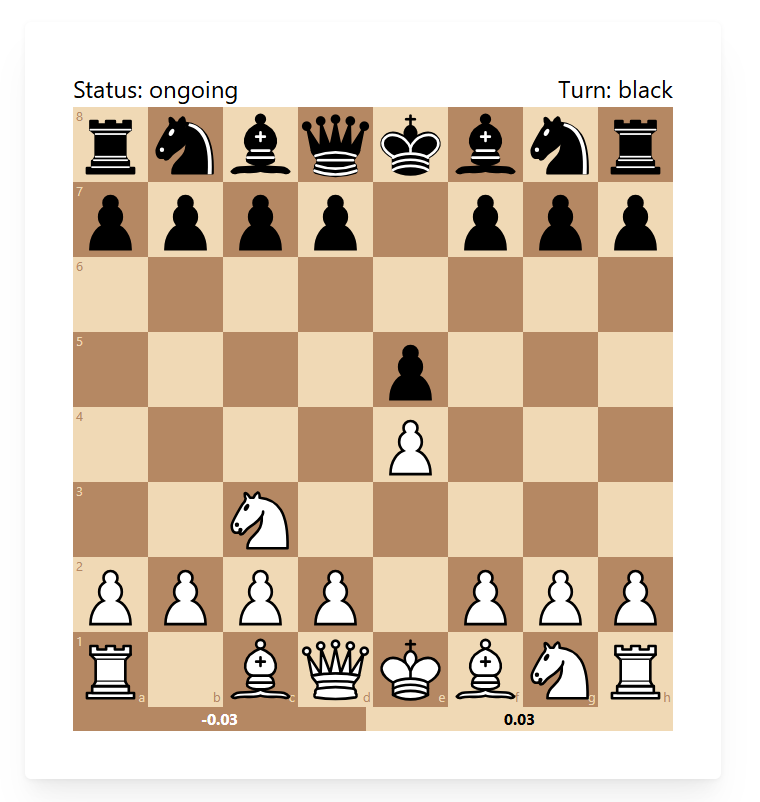

# Blunder Buster

Blunder Buster is a human like chess robot. It uses the min-max-algorithm combined with a DNN to calculate what moves to do when. 

The webapp itself also uses the same DNN to evaluate the current position and show what side it thinks is winning.

||
|:---:|
| A screenshot taken from a game. The robot is black |

# How to run

### Backend

First you need to install Keras, Tensorflow, chess, and FastAPI. Then run:
```shell
fastapi dev api_point.py
```

Example use of API

> /move?position=r1br4/1p3pkp/p2p2p1/3Pp3/3R4/1N3P2/P1P3PP/5R1K%20w%20-%20-%200%2024
> /eval?position=r1br4/1p3pkp/p2p2p1/3Pp3/3R4/1N3P2/P1P3PP/5R1K%20w%20-%20-%200%2024

### Frontend

After running the backend, run:
```shell
cd webapp
npm i
npm run dev
```


# Making the DNN-evaluator

## FEN-position to input

To make it easier for the DNN to learn from the positions, they have to be formatted. 

The standard notation for chess-position is the Forsyth-Edwards Notation (FEN). An example of such a FEN-string is

- r3kb1r/ppp3pp/2bp1q2/4p3/3P4/5N2/PPP2PPP/R1BQR1K1 b kq - 0 10

||
|:---:|
| The chess position for the FEN-string |

To keep the network light, I wanted to minimize the amount of inputs. For that reason, the network only gets fed what I find to be the most important parts of the FEN-string; the first 3 words:
- the piece placement (*r3kb1r/ppp3pp...*)
- whos turn it is (*b*)
- and the castling-possibilities (*kq*)

### Formatting the piece placement

The piece-placement is formatted into a 3d-array; (8 x 8 x 8), meaning each square is represented by an array of size 8. 
The first 2 items in the array represents the color of the piece present. 
The rest represent the type of piece: ``[Black, White, Rook, Knight, Bischop, Queen, King, Pawn]``.

**Examples:**

- ``[1, 0, 1, 0, 0, 0, 0, 0]`` - Black Rook
- ``[0, 0, 1, 0, 0, 0, 0, 0]`` - White Rook
- ``[1, 0, 0, 0, 0, 0, 1, 0]`` - Black King

If there is no piece in the square the array is a ``zero-array``

### Formatting turn and castling info

The turn and castling information are all formatted into one array of size 5. The first item in the array represents whos turn it is. The other 4 items represent whether white can castle (right and left), and if black can castle (right and left). E.g. if its whites turn and both sides have all their castling opportunities then the array will be ``[1, 1, 1, 1, 1]``

## The network itself

The piece-placement itslef is fed into a deep convolution network, while the metadata is fed into a Fully-Connected-Network (FCN). Then the outputs of the convolution network and the FCN are combined and fed into the same Fully-Connected-Deep Network. The network has 1 output; which is the prediction for the evaluation of the position.

## Getting data

I wanted to
- Make a chess position evaluator
- and do supervised learning

For this I needed a database of positions as well evaluations. As I dont have enough chess knowledge to create labels myself, I needed a third party to do it instead. Lichess; a popular website for playing chess, provides uploads the games that has been played on the website over time. I chose the games played in [August 2015](https://database.lichess.org/) as it had the perfect amount of games. 

Each game consisted of moves and some other irrelevant information. Some, but not all games, included evaluations, so I had to filter out the ones that lacked evaluations using [filter.py](handle_data/filter.py). 

Then I transformed each move into their corresponding positions by playing out the games and saving the positions as they happened. The games were also transformed so that the positions could be trained on. All this was done by [create_boards.py](handle_data/create_boards.py)

## Training the network

**TODO**

# Useful links to learn more

- [chess.js](https://github.com/jhlywa/chess.js/tree/master)
- [React chessboard](https://github.com/Clariity/react-chessboard)
- [Pyton chess](https://github.com/niklasf/python-chess)
- [Lichess database](https://database.lichess.org/)
- [Fast API](https://fastapi.tiangolo.com/#run-it)
 - [Nice tutorial](https://blog.postman.com/how-to-build-an-api-in-python/)
- [Mantine](https://mantine.dev/core/flex/)
