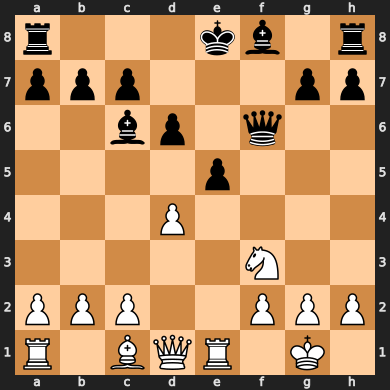

# Blunder Buster

Blunder buster is a deep neural network that uses convolution layers as well as FCL

# FEN-position to input

To make it easier for the DNN to learn from the positions, they have to be formatted. 

A normal notation for chess-position is the Forsyth-Edwards Notation (FEN). An example of such a FEN-string is

- r3kb1r/ppp3pp/2bp1q2/4p3/3P4/5N2/PPP2PPP/R1BQR1K1 b kq - 0 10

||
|:---:|
| The chess position for the FEN-string |

To keep the network light, I wanted to minimize the amount of inputs. For that reason, the network only gets fed what I find to be the most important parts of the FEN-string; the first 3 words:
- the piece placement (*r3kb1r/ppp3pp...*)
- whos turn it is (*b*)
- and the castling-possibilities (*kq*)

### Formatting the piece placement

The piece-placement is formatted into a 3d-array; (8 x 8 x 8), meaning each square is represented by an array of size 8. 
The first 2 items in the array represents the color of the piece present. 
The rest represent the type of piece.
If there is no piece in the square the array is a zero-array.

### Formatting turn and castling info

The turn and castling information are all formatted into one array of size 5. The first item in the array represents whos turn it is. The other 4 items represent whether white can castle (right and left), and if black can castle (right and left). E.g. if its whites turn and both sides have all their castling opportunities then the array will be [1, 1, 1, 1, 1]